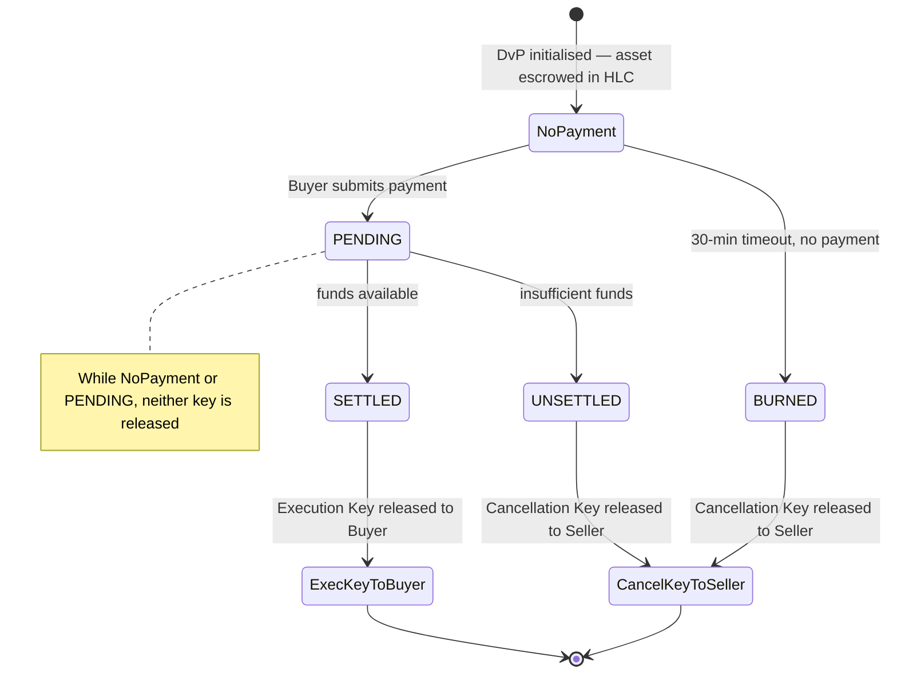
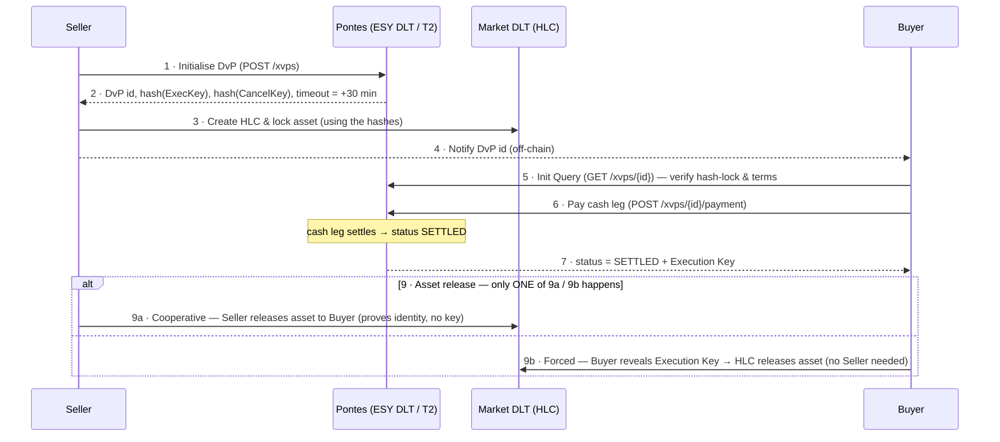
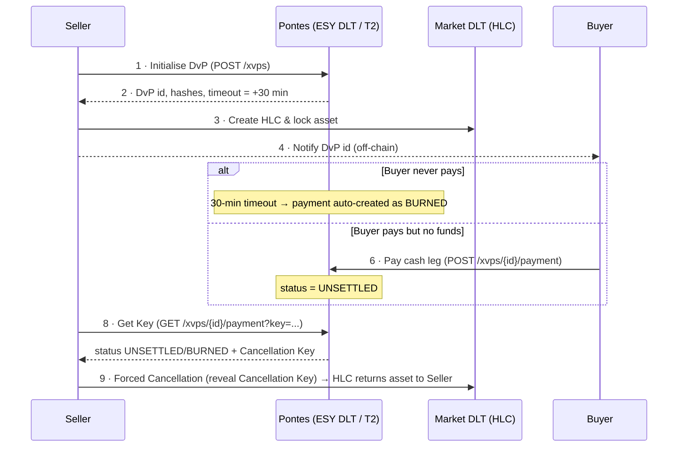

# Pontes — Executive Summary

> **Unofficial summary.** This document is an independent, plain-language overview of the
> Eurosystem's **Pontes** initiative, written for orientation purposes. It is **not** an
> official European Central Bank (ECB) publication and is not affiliated with or endorsed by
> the ECB or the Eurosystem. Always rely on the official documentation (see
> [References](#7-references)) for binding information. Figures, dates and eligibility rules
> reflect the Pilot-phase documents available at the time of writing and are subject to change.
> Sections labelled **Assessment** reflect the author's independent analysis, not an ECB position.

---

## 1. What is Pontes?

**Pontes** is a Eurosystem (ECB) initiative that lets transactions executed on **Distributed
Ledger Technology (DLT)** platforms be settled in **central bank money (CeBM)** in euro. It
answers a concrete market need: DLT-based markets have lacked a safe, central-bank-money cash
leg, which has held back their adoption at scale.

Pontes provides exactly that **cash leg**. The securities or other assets stay on the market's
own DLT platform; Pontes settles the **payment** side in euro central bank money, linking the
two so that delivery and payment can happen together.

The current stage is a **Pilot Phase** (targeting go-live in Q3 2026), deliberately built to
require **no changes to the existing legal, regulatory and operational framework of the TARGET
Services**, and operated *outside* the technical perimeter of TARGET for now. The longer-term
ambition is for Pontes to become a fully integrated TARGET Service.

At the centre is the **ESY DLT platform** (the Eurosystem-operated, permissioned infrastructure
that manages the cash leg). Crucially, it offers **two independent settlement models**, and a
participant can use **either one on its own** — see [Section 3](#3-the-two-settlement-models--which-to-use).
The whole service operates in a **daily window of 09:00–16:00 CET on T2 business days**; nothing
is held overnight.

---

## 2. Who is Pontes for?

Pontes is a **wholesale**, permissioned system for regulated financial-market actors. The
defined roles are:

- **National Central Banks (NCBs)** — each Eurosystem NCB that has participating clients runs
  its own **node** on the ESY DLT and admits/manages its community of market participants.
- **European Central Bank (ECB)** — issues and redeems cash tokens (the *issuer node*) and is
  the legal owner of the technical T2 accounts that back the tokens.
- **Service Providers (4CB)** — the national central banks (BBk, BdE, BdF, BdI) that
  **develop, host and operate** the platform on behalf of the Eurosystem.
- **Market Participants** — entities with access to TARGET (within the meaning of the TARGET
  Guideline). They may own a **Dedicated Cash Wallet (DCW)** — needed **only** for the
  cash-token model — and instruct payments and settlement.
- **Market DLT Operators** — operators of the market-side DLT platforms, acting *on behalf of*
  market participants. Eligible types include CSDs (CSDR), DSS/DTSS operators (DLT Pilot
  Regime), overseen payment-system operators, CCPs (EMIR), and authorised credit
  institutions / investment firms / market operators under CRD / MiFID II.

> **Access is gated.** Pontes is not an open or public network. Every endpoint is protected by
> per-NCB OAuth2 + JWT, and participation requires meeting Eurosystem eligibility criteria and
> being **onboarded and registered through a specific NCB**. Independent advisors or technical
> providers do not have a standalone access role; they typically operate *under* an eligible
> client's onboarding (e.g. via designated indirect access to a participant's DCWs, or
> "instruct-on-behalf" arrangements).

---

## 3. The two settlement models — which to use

Pontes settles the cash leg in **one of two ways**. They are **parallel and independent**: you
pick per transaction, and you can run entirely on one of them.

- **Direct RTGS (trigger model).** The instruction enters through the ESY DLT, but settlement
  happens **directly in T2 RTGS** between the two participants' RTGS accounts (via ISO 20022
  messages such as `pacs.010`/`pacs.009`), with **immediate finality**. **No tokens are minted,
  no Dedicated Cash Wallet is required, and there is no funding step.** The official docs are
  explicit: *"In case a market participant only uses direct settlement in T2, it is not needed
  for the market participant to own a DCW"* (BDD), and *"this functionality does not require
  Market participants to own a DCW"* (SDD).
- **Cash Token model.** You first **fund** (debit your T2 RTGS account → mint cash tokens on the
  ESY DLT), settle by moving tokens between wallets, and later **defund** (redeem tokens → credit
  T2). Any token balance left at the close is **automatically swept back to T2 at end of day**.
  Real settlement in central-bank money occurs **at the defunding/sweep**, not on each token
  move; intraday a token is a *claim on the ECB*, not yet settled CeBM.

> **Funding and defunding are NOT a mandatory part of using Pontes — they belong exclusively to
> the Cash Token model.** If you use Direct RTGS, you never touch them.

For DvP/PvP, **both** models use the **Hash-Link protocol** to achieve "all-or-none" settlement
across the asset ledger and the cash leg.

### 3.1 Comparison matrix

| Dimension | **Direct RTGS** (trigger) | **Cash Token** |
|---|---|---|
| Dedicated Cash Wallet required | **No** | Yes |
| Funding / defunding steps | **None** | Required (fund first; defund or automatic EOD sweep) |
| Liquidity management | **Single pool** in T2 RTGS | **Fragmented**: split between T2 and the wallet, re-done every day |
| CeBM finality | **Immediate, per transaction** | Deferred to defunding / EOD sweep (intraday = ledger entry + claim on ECB) |
| Touches T2 per transaction | Yes (every payment) | No (only funding / defunding / sweep hit T2) |
| Intraday throughput (many ops) | Bounded by a T2 round-trip per op | **High** once pre-funded (settles on-ledger) |
| Programmable / conditional cash | No | **Yes** (cash lives on-ledger) |
| Access to intraday credit / LoLR | **Direct** (in T2) | Indirect (must route through T2 first) |
| DvP/PvP atomicity | Hash-Link protocol | Hash-Link protocol (same) |
| Operating window | 09:00–16:00 CET, T2 business days | Same |
| Overnight position | Settled — nothing to hold | Not allowed — swept to zero nightly |

### 3.2 When to use each

- **Direct RTGS — the sensible default.** Standard wholesale payments, coupon payments, margin
  calls, and DvP/PvP against assets tokenised on an external market DLT — i.e. essentially every
  mainstream Pilot use case. You keep one liquidity pool and get immediate per-transaction
  finality.
- **Cash Token — a niche.** Worth the overhead only when **either** (a) you have **very high
  intraday transaction velocity within a closed group of token holders**, where avoiding one T2
  settlement per transaction is a genuine bottleneck, **or** (b) you need **programmable /
  conditional cash** embedded in on-ledger smart-contract logic. In return you accept liquidity
  fragmentation and deferred finality.

### 3.3 Assessment

> **In the current Pilot, Direct RTGS dominates for almost all participants.** It delivers the
> same central-bank-money settlement — and the same Hash-Link atomicity for DvP/PvP — *without* a
> Dedicated Cash Wallet, *without* funding/defunding, *without* fragmenting liquidity, and with
> *immediate* per-transaction finality. Note that the asset being settled lives on an **external**
> market DLT, not on the ESY DLT, so there is **no single-ledger atomicity** to gain from tokens:
> cross-ledger DvP needs a Hash-Link either way.
>
> The Cash Token model adds a layer whose real advantages — on-ledger programmability, high
> intraday throughput, and 24/7 potential — are **largely forward-looking**, and the Pilot
> deliberately caps them (market-hours-only window, mandatory nightly sweep, no overnight
> balances). It therefore has **very few practical use cases today**; its rationale is mainly to
> test and prepare for a future where assets *and* cash share a ledger.
>
> **Bottom line: for a participant deciding now, Direct RTGS should be the default, and the Cash
> Token model only makes sense when a specific high-velocity or programmable-cash use case
> justifies its extra complexity and liquidity cost.**

---

## 4. How cross-ledger DvP/PvP works (the Hash-Link protocol)

A **DvP** (Delivery-versus-Payment) or **PvP** has two legs on **two different ledgers**: the
**asset** leg lives on the **external Market DLT platform**, and the **cash** leg lives on
**Pontes** (ESY DLT / T2). Pontes never touches the asset — it handles only the cash leg and the
cryptographic conditions that bind the two. Atomic "all-or-none" settlement across the ledgers is
achieved with the **Hash-Link Protocol**, *not* with single-ledger atomicity (there is no shared
ledger).

**Roles.** The **Seller** delivers the asset and receives cash; the **Buyer** receives the asset
and pays cash.

**The two secrets.** Pontes generates an **Execution Key** and a **Cancellation Key** and, at
initialisation, returns only their **hashes**. The Seller uses those hashes to build a
**Hash-Link Contract (HLC)** on the Market DLT that escrows the asset. The HLC releases the asset
**to the Buyer** if the Execution Key is presented, or **back to the Seller** if the Cancellation
Key is presented.

**The guarantee.** Pontes releases **exactly one** of the two keys, and only once the cash-leg
outcome is final — so the two legs can never end out of sync. The cash-leg status drives which
key (if any) is disclosed:

**The clock — a 30-minute window.** Each DvP carries a **timeout = creation time + 30 minutes**
(a system parameter set by the Operator, currently **30 min for all DvP/PvP**). It marks (i) the
deadline for the Buyer to pay the cash leg and (ii) the point after which the Seller may claim the
Cancellation Key if nothing settled. **Note the asymmetry:** it is the **asset** that sits
escrowed in the HLC for up to 30 minutes — the Buyer's **cash is *not* pre-locked**; it is debited
only at the moment of payment and settles or fails near-instantly. If the window lapses with no
payment, Pontes auto-creates the payment as **BURNED**, freeing the Seller to cancel.

**Cash-leg finality** depends on the model picked at initialisation (fixed for the whole
lifecycle): with **Direct RTGS** the cash settles immediately in T2 (`pacs.010` debit Buyer →
`pacs.009` credit Seller); with **Cash Token** the wallets move immediately on-ledger but CeBM
finality only crystallises at defunding / the EOD sweep.

> Pontes's perimeter ends at delivering the key + payment status. Creating the HLC and
> locking/unlocking the asset all happen on the Market DLT and are the Market DLT Operator's
> responsibility.

The step numbers (**1–9**) are the same across the two diagrams below and the endpoint table in
§4.3, so you can read all three together. Steps **1–4** are shared by both paths; **5** and **7**
only occur on the happy path; **8** only on the unhappy path. Steps without an API call (2, 3, 4,
7, 9 — responses, off-chain notice, or actions on the Market DLT) are not in the endpoint table.

### 4.1 Happy path — Buyer pays, asset delivered

### 4.2 Unhappy path — timeout or no funds, asset returned to Seller

### 4.3 The endpoints (A2A)

Called by the Market Participant or by a Market DLT Operator on its behalf. The two settlement
models share the same shape; Direct RTGS just adds the `/direct-rtgs` segment. The **Step** column
matches the numbers in the §4.1 / §4.2 diagrams.

| Step | Call | Actor | Endpoint (Cash Token · Direct RTGS) |
|:----:|------|-------|--------------------------------------|
| **1** | Initialise DvP | Seller | `POST /igw/{ncb}/v1/xvps` · `POST /igw/{ncb}/v1/direct-rtgs/xvps` |
| **5** | Init Query (get hash-lock) | Buyer | `GET /igw/{ncb}/v1/xvps/{id}` · `.../direct-rtgs/xvps/{id}` |
| **6** | Pay cash leg | Buyer | `POST /igw/{ncb}/v1/xvps/{id}/payment` · `.../direct-rtgs/...` |
| **8** | Get Key & status | Seller / Buyer | `GET /igw/{ncb}/v1/xvps/{id}/payment?key={key}` · `.../direct-rtgs/...` |

*Step 8 is the explicit fallback to fetch a key after the fact (the Seller's Cancellation Key on
the unhappy path, or the Buyer's Execution Key if it lost the step-7 response). On the happy path
the Buyer already receives the Execution Key in step 7, so step 8 is not needed.*

---

## 5. How the Pontes network is used (functional view)

Interaction follows a participant's **lifecycle**: first onboarding, then reference-data
set-up, then day-to-day operations.

### 5.1 Onboarding & reference data
- Onboarding of **market participants** and **market DLT operators** (admitted by their NCB).
- Set-up of **T2 Account References**, optionally **Dedicated Cash Wallets** (only for the token
  model), **whitelists** (which counterparties/wallets may interact), and **powers of attorney /
  instruct-on-behalf** mandates.
- Querying business calendar data: business date, business windows, closed days, the list of
  participating NCBs and market DLT platforms.

### 5.2 Funding & defunding *(Cash Token model only)*
- **Funding** — convert T2 RTGS balances into cash tokens on the ESY DLT.
- **Defunding** — redeem cash tokens back into T2 RTGS balances (also forced automatically at the
  end-of-day sweep).
- *Skip this entirely if you settle via Direct RTGS.*

### 5.3 Settlement & payments
- **Payments** — in either model: *Cash Token* or *Direct RTGS*.
- **Transfers** — wallet-to-wallet cash-token movements (token model).
- **XvP (DvP / PvP)** — Delivery-versus-Payment and Payment-versus-Payment, coordinated with the
  market DLT platform (via Hash-Link) so the asset and cash legs settle conditionally together.
  Available for **both** Cash Token and Direct RTGS.
- **Payment Free of Delivery (PFoD)** — payment leg without a coupled delivery.
- **Instruct on behalf** — an operator or another participant instructs on behalf of the DCW
  owner.
- **Contingency operations** — issuance/redemption fallbacks for exceptional situations.

### 5.4 Information & monitoring
- **Queries and extracts** across participants, accounts, wallets, transactions, funding/
  defunding and balances, plus operational statistics and platform health.

### 5.5 Two cross-cutting concepts
- **Validation Workflow — "2-Step" vs "1-Step".** Most sensitive operations follow a *4-eyes*
  model: they are created as a **draft** (first action) and then **approved or rejected**
  (second action). 1-Step variants book immediately.
- **Transaction Type — "Cash Token" vs "Direct RTGS".** Many flows exist in both flavours; the
  choice is exactly the settlement-model decision discussed in [Section 3](#3-the-two-settlement-models--which-to-use).

### 5.6 Interfaces
- **A2A (Application-to-Application)** — a REST API (the *EII API*, specified in OpenAPI),
  secured per NCB with OAuth2 (`OAuth2_A2A_<NCB>`) and JWT. It interoperates with existing
  TARGET / T2 RTGS interfaces using standard ISO 20022 messages.
- **U2A (User-to-Application)** — a Graphical User Interface for manual operation and monitoring.

---

## 6. Access, testing & timeline

- **Test environment:** a single shared environment ("L2 Test Environment") hosts Eurosystem
  Acceptance Testing (EAT), Central Bank Testing (CBT) and User Testing (UT), interconnected
  with the T2 UTEST environment.
- **To get in:** complete registration for User Testing **with your NCB**, pass connectivity
  testing, and execute the mandatory test cases for certification.
- **Indicative timeline:** Pilot go-live targeted for **Q3 2026**; onboarding of new actors
  open until **31 December 2027** (dates per Pilot documents, subject to change).

---

## 7. References

Official ECB Pontes documentation (professional-use documents on ecb.europa.eu, Spanish editions):

- [**Business Description Document (BDD)**](https://www.ecb.europa.eu/paym/target/target-professional-use-documents-links/pontes/shared/pdf/ecb.pontes260220_bdd.es.pdf?e8f124d2fef5aafadfb68f1859e0c3ab) — business model, actors and scope.
- [**Service Description (SDD)**](https://www.ecb.europa.eu/paym/target/target-professional-use-documents-links/pontes/shared/pdf/ecb.pontes260515_sddv1.es.pdf?a0226f3879cd414881356b465516b5dd) — the functional specification (each API feature maps to a chapter of this document).
- [**User Requirements Document (URD)**](https://www.ecb.europa.eu/paym/target/target-professional-use-documents-links/pontes/shared/pdf/ecb.pontes260417_urd1.es.pdf?d9d75baf5783de3520275f2de00a53ce).
- [**User Handbook (UHB)**](https://www.ecb.europa.eu/paym/target/target-professional-use-documents-links/pontes/shared/pdf/ecb.pontes260515_uhbv1.es.pdf?841a31eae6bd2db9049117f5b8b002fa) — operational guidance.
- [**Testing and Onboarding Strategy**](https://www.ecb.europa.eu/paym/target/target-professional-use-documents-links/pontes/shared/pdf/ecb.pontes260227_testingstrategy.es.pdf?de694195bdc4dfad4928c8f228588487).
- [**Testing Terms of Reference (ToR)**](https://www.ecb.europa.eu/paym/target/target-professional-use-documents-links/pontes/shared/pdf/ecb.pontes260527_ttorv1.es.pdf?a193cb4d8f0df2928a165501bc88bcd4).
- [**Mandatory Test Cases**](https://www.ecb.europa.eu/paym/target/target-professional-use-documents-links/pontes/shared/pdf/ecb.pontes260605_testcases.es.pdf?ab455c15eb87524853577463be75caef).

Official portal: <https://www.ecb.europa.eu/paym/target/> → TARGET professional-use documents → Pontes.

---

*This summary was prepared independently for orientation and does not reproduce any ECB
document. For authoritative detail and current eligibility/onboarding rules, consult the
official documents above and the relevant National Central Bank.*
